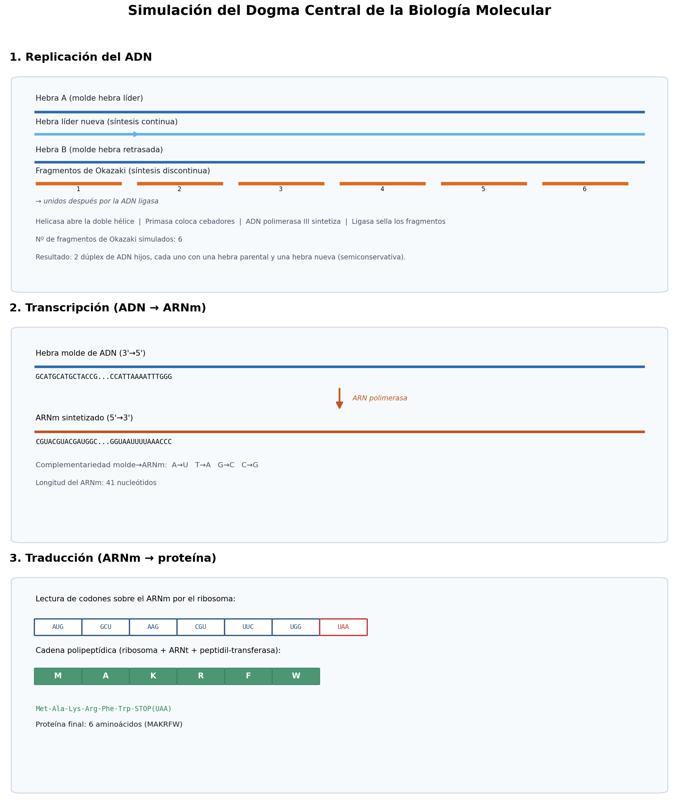

# Simulador del Dogma Central de la Biología Molecular

**Bioinformática — Práctica 1**

Simulador en Python que representa, de forma integrada, el flujo de la
información genética descrito por el dogma central:

```
ADN  --( replicación )-->  ADN
ADN  --( transcripción )--> ARNm
ARNm --( traducción )-->   Proteína
```

A partir de una molécula de ADN de doble hebra introducida por el
usuario, el programa simula paso a paso la **replicación** (incluyendo
hebra líder, hebra retrasada y fragmentos de Okazaki), la
**transcripción** a ARN mensajero y la **traducción** a una secuencia de
aminoácidos, mostrando en cada etapa las moléculas y enzimas
involucradas y las reglas de complementariedad de bases aplicadas.

## Índice

- [Objetivos](#objetivos)
- [Instalación](#instalación)
- [Uso](#uso)
- [Ejemplo de ejecución](#ejemplo-de-ejecución)
- [Qué representa cada etapa](#qué-representa-cada-etapa)
- [Estructura del proyecto](#estructura-del-proyecto)
- [Simplificaciones y supuestos](#simplificaciones-y-supuestos)
- [Pruebas](#pruebas)
- [Cómo subir este proyecto a GitHub](#cómo-subir-este-proyecto-a-github)

## Objetivos

- Comprender de forma integrada los procesos de replicación,
  transcripción y traducción de la información genética.
- Representar mediante un programa el flujo de la información
  biológica desde el ADN hasta la síntesis de una proteína.
- Identificar el papel de las principales moléculas y enzimas que
  intervienen en cada uno de los procesos.
- Diferenciar la formación de la cadena líder y de la cadena
  rezagada durante la replicación, incluyendo los fragmentos de
  Okazaki.

## Instalación

Requiere **Python 3.8+**. Solo hace falta `matplotlib` (para generar el
diagrama de imagen); el resto del programa usa exclusivamente la
biblioteca estándar.

```bash
git clone <URL-DE-TU-REPOSITORIO>
cd dogma-central-simulador
pip install -r requirements.txt
```

## Uso

### Modo interactivo (por defecto)

```bash
python main.py
```

El programa pedirá una secuencia de ADN por teclado (solo bases
`A, T, G, C`). Si se pulsa `ENTER` sin escribir nada, se usa una
secuencia de ejemplo que incluye codón de inicio y codón de parada.

### Modo por argumentos

```bash
# Simular una secuencia propia
python main.py --secuencia ATGGCTAAGCGTTTCTGGTAA

# Leer la secuencia desde un fichero de texto
python main.py --archivo mi_adn.txt

# Cambiar el tamaño de los fragmentos de Okazaki (por defecto 8 nt)
python main.py --secuencia ATGGCTAAGCGTTTCTGGTAA --okazaki 5

# Elegir qué hebra actúa como molde en la transcripción (A o B)
python main.py --secuencia ATGGCTAAGCGTTTCTGGTAA --hebra-molde A

# No generar el diagrama PNG (solo texto)
python main.py --secuencia ATGGCTAAGCGTTTCTGGTAA --sin-diagrama

# Elegir carpeta de salida para el informe y el diagrama
python main.py --secuencia ATGGCTAAGCGTTTCTGGTAA --salida mis_resultados
```

Todas las opciones disponibles:

```bash
python main.py --help
```

Cada ejecución guarda en la carpeta de salida (`resultados/` por
defecto):

- `informe_simulacion.txt` — el informe de texto completo.
- `diagrama_dogma_central.png` — un resumen visual de las tres etapas.

## Ejemplo de ejecución

Con la secuencia de ejemplo `CGTACGTACGATGGCTAAGCGTTTCTGGTAATTTTAAACCC`
(un fragmento de ADN con una región 5' no codificante, un marco de
lectura ATG→…→TAA, y una región 3' no codificante), el simulador
produce, entre otras cosas:

```
ARNm sintetizado  5'-CGUACGUACG AUGGCUAAGC GUUUCUGGUA AUUUUAAACC C-3'
...
Secuencia (3 letras): Met-Ala-Lys-Arg-Phe-Trp-STOP(UAA)
Secuencia (1 letra):  MAKRFW
```

El informe de texto completo de este ejemplo está en
[`ejemplos/informe_ejemplo.txt`](ejemplos/informe_ejemplo.txt), y el
diagrama visual correspondiente es:



## Qué representa cada etapa

### 1. Replicación del ADN

- **Helicasa**: abre la doble hélice rompiendo los puentes de
  hidrógeno entre bases complementarias, generando la horquilla de
  replicación.
- **Proteínas SSB** y **topoisomerasa**: estabilizan las hebras
  separadas y alivian la tensión torsional.
- **Primasa**: sintetiza los cebadores de ARN necesarios para iniciar
  la síntesis de ADN.
- **ADN polimerasa III**: sintetiza nuevo ADN 5'→3' sobre cada hebra
  molde.
  - **Hebra líder**: se sintetiza de forma **continua**, ya que el
    molde se lee en el mismo sentido que avanza la horquilla.
  - **Hebra retrasada**: se sintetiza de forma **discontinua**, en
    **fragmentos de Okazaki**, porque su molde se lee en sentido
    contrario al avance de la horquilla. El tamaño de cada fragmento
    es configurable con `--okazaki`.
- **ADN ligasa**: une entre sí los fragmentos de Okazaki (tras la
  eliminación de los cebadores de ARN) para formar una hebra
  retrasada continua.
- **Resultado**: dos moléculas de ADN hijas, cada una compuesta por
  una hebra parental original y una hebra recién sintetizada
  (**replicación semiconservativa**).

### 2. Transcripción (ADN → ARNm)

- **ARN polimerasa**: reconoce el promotor, abre localmente la doble
  hélice y sintetiza el ARNm 5'→3' leyendo la hebra molde en
  dirección 3'→5'.
- Se aplica la complementariedad **ADN molde → ARNm**:
  `A→U`, `T→A`, `G→C`, `C→G` (el ARN no contiene timina).
- El usuario puede elegir qué hebra actúa como molde (`--hebra-molde
  A|B`); por defecto se usa la Hebra B, de modo que la Hebra A
  (introducida por el usuario) actúa como hebra codificante.

### 3. Traducción (ARNm → proteína)

- El **ribosoma** localiza el primer codón de inicio `AUG`, que fija
  el marco de lectura.
- Los **ARN de transferencia (ARNt)**, mediante complementariedad
  codón-anticodón, aportan el aminoácido correspondiente a cada
  codón según el **código genético estándar** (64 codones).
- La **peptidil-transferasa** del ribosoma forma los enlaces
  peptídicos entre aminoácidos consecutivos.
- La traducción continúa hasta encontrar un **codón de parada**
  (`UAA`, `UAG` o `UGA`), momento en el que un factor de liberación
  provoca la separación del ribosoma y la liberación de la proteína.

## Estructura del proyecto

```
dogma-central-simulador/
├── main.py                     # Punto de entrada (CLI / modo interactivo)
├── dogma/
│   ├── __init__.py
│   ├── biologia.py             # Tablas: complementariedad y código genético
│   ├── simulador.py            # Motor: replicación, transcripción, traducción
│   ├── presentacion.py         # Formato de texto para consola/informe
│   └── diagrama.py             # Generación del diagrama PNG (matplotlib)
├── tests/
│   └── test_simulador.py       # Pruebas unitarias
├── ejemplos/
│   ├── informe_ejemplo.txt
│   └── diagrama_ejemplo.png
├── requirements.txt
├── .gitignore
├── LICENSE
└── README.md
```

## Simplificaciones y supuestos

Un simulador didáctico de este tipo necesariamente simplifica
respecto a la biología real. Se han documentado explícitamente las
siguientes decisiones:

- Se simula un **único origen y una única horquilla de replicación**
  avanzando en un solo sentido a lo largo del fragmento de ADN
  proporcionado (en la célula real hay múltiples orígenes y la
  horquilla suele ser bidireccional).
- Los **cebadores de ARN** se representan de forma simbólica
  (longitud reducida) para mantener la legibilidad de la salida.
- No se modelan explícitamente el corte/empalme (*splicing*) del
  ARN ni modificaciones postraduccionales; se asume un gen sin
  intrones, como es habitual en procariotas y en ejercicios
  introductorios.
- La traducción se detiene en el **primer** codón de parada
  encontrado a partir del **primer** `AUG` del ARNm.

## Pruebas

El proyecto incluye pruebas unitarias que verifican la
complementariedad de bases, la reconstrucción correcta de las hebras
tras la replicación (incluyendo los fragmentos de Okazaki), la
transcripción y la traducción:

```bash
python -m unittest discover tests -v
```

## Cómo subir este proyecto a GitHub

Este proyecto ya incluye un repositorio Git local con un primer
commit. Para publicarlo en tu cuenta de GitHub:

1. Crea un repositorio vacío en GitHub (sin README, sin licencia,
   sin `.gitignore`, para evitar conflictos), por ejemplo
   `dogma-central-simulador`.
2. En este proyecto, añade tu repositorio remoto y sube el código:

   ```bash
   git remote add origin https://github.com/<tu-usuario>/dogma-central-simulador.git
   git branch -M main
   git push -u origin main
   ```

3. Comprueba en GitHub que todos los ficheros (incluida la carpeta
   `ejemplos/` con la imagen) se han subido correctamente.

## Autoría

Práctica 1 de Bioinformática — Simulación del dogma central de la
biología molecular.
