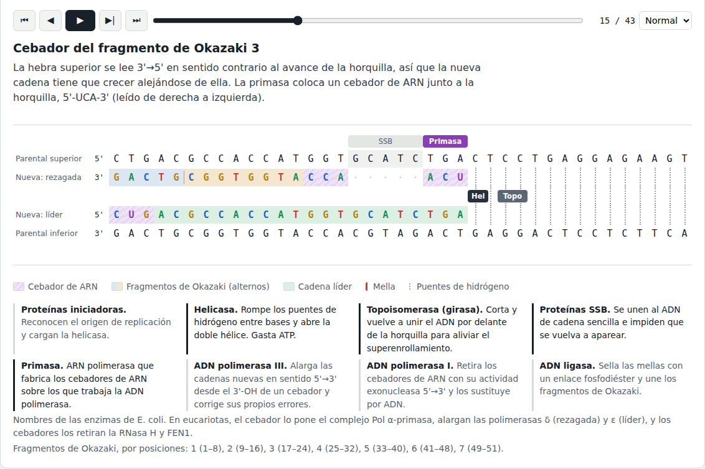
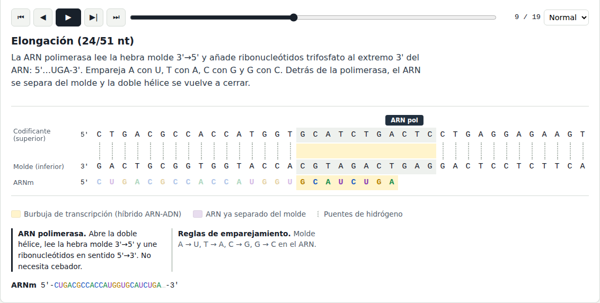
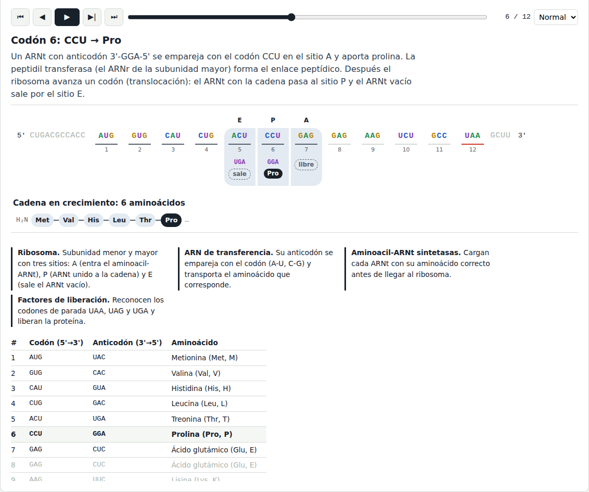

# Simulador del dogma central de la biología molecular

Práctica 1 de Bioinformática (ULPGC, EII).

Una aplicación web en Python que parte de una molécula de ADN y muestra, paso a paso, cómo se replica, cómo se transcribe a ARN mensajero y cómo ese ARNm se traduce a proteína:

**ADN → ADN → ARN → proteína**



## Puesta en marcha


```bash
git clone https://github.com/<usuario>/dogma-central.git
cd dogma-central
pip install -r requirements.txt
python app.py
```

Abrir <http://127.0.0.1:5000> en el navegador.

También hay una versión en texto para la terminal:

```bash
python -m dogma ATGGCCTTTAAGTGA            # secuencia propia
python -m dogma --aleatoria --pasos        # gen aleatorio, con la explicación de cada paso
python -m dogma SECUENCIA --molde superior --fragmento 6 --cebador 2
```

Para ejecutar pruebas:

```bash
pip install -r requirements-dev.txt
pytest
```

## Uso

1. Escribe o pega la hebra superior del ADN en sentido 5'→3'. Se admiten formato FASTA, minúsculas, espacios y números. También puedes elegir uno de los ejemplos o generar un gen aleatorio.
2. Si quieres, ajusta los parámetros: la longitud de cada fragmento de Okazaki, la longitud de los cebadores de ARN y la hebra que hará de molde en la transcripción.
3. Pulsa **Simular**. Cada etapa tiene su pestaña y un reproductor para avanzar paso a paso o de forma automática. También puedes usar las flechas del teclado sobre la visualización.
4. Al final de la página, un resumen muestra la secuencia en cada punto del flujo.

### Ejemplos incluidos

| Ejemplo | Qué muestra |
|---|---|
| Inicio de la β-globina humana | Los 11 primeros codones del gen *HBB* con un codón de parada añadido. Da `MVHLTPEEKSA`. |
| β-globina con la mutación falciforme | El cambio GAG→GTG en el codón 7 sustituye ácido glutámico por valina (`MVHLTPVEKSA`). Una sola base cambiada altera la proteína. |
| Gen en la hebra inferior | Con el molde inferior sale un péptido sin codón de parada. Con el molde superior aparece el gen completo (`MKFYWSSK`). |

## Qué simula cada etapa

### 1. Replicación (ADN → ADN)

La molécula se dibuja con la hebra superior 5'→3' de izquierda a derecha. Una horquilla sale del origen, en el extremo izquierdo, y avanza hacia la derecha.

| Paso | Moléculas y enzimas |
|---|---|
| Reconocimiento del origen | Proteínas iniciadoras |
| Apertura de la doble hélice | Helicasa (rompe los puentes de hidrógeno), topoisomerasa (alivia el superenrollamiento por delante), proteínas SSB (estabilizan el ADN de cadena sencilla) |
| Cebador de la cadena líder | Primasa. Un solo cebador de ARN (con U). |
| Síntesis de la cadena líder | ADN polimerasa III. Síntesis continua 5'→3' en el sentido de avance de la horquilla. |
| Cebador de cada fragmento de Okazaki | Primasa. Uno por fragmento, junto a la horquilla. |
| Síntesis del fragmento de Okazaki | ADN polimerasa III. Crece 5'→3' alejándose de la horquilla. |
| Retirada del cebador anterior | ADN polimerasa I. Actividad exonucleasa 5'→3' y relleno con ADN. Deja una mella. |
| Unión de fragmentos | ADN ligasa. Forma el enlace fosfodiéster que falta. |
| Cebadores de los extremos | ADN polimerasa I. Se explica el problema de la replicación de los extremos y el papel de la telomerasa. |
| Resultado | Dos moléculas hijas. Cada una conserva una hebra parental (replicación semiconservativa) y el programa comprueba que son idénticas a la original. |

En pantalla, las hebras parentales van en negro y las nuevas con cada base coloreada. Los cebadores de ARN se ven rayados, los fragmentos de Okazaki alternan color de fondo, las mellas se marcan en rojo y los puentes de hidrógeno de la zona todavía apareada, con líneas punteadas.

### 2. Transcripción (ADN → ARN)



La transcripción se hace sobre la molécula hija 1, para que la información pase de verdad de una etapa a la siguiente. La ARN polimerasa lee la hebra molde 3'→5' y sintetiza el ARNm 5'→3', con las reglas A→U, T→A, C→G y G→C. La visualización muestra la burbuja de transcripción con el híbrido ARN-ADN, el ARN que se va separando del molde y la doble hélice que se cierra detrás. Se puede elegir cualquiera de las dos hebras como molde; si es la superior, la polimerasa avanza de derecha a izquierda.

### 3. Traducción (ARN → proteína)



El ribosoma recorre el ARNm desde el extremo 5' hasta el primer AUG, lo que fija el marco de lectura. En cada paso se ven:

- los sitios E, P y A del ribosoma;
- el ARNt de cada codón con su anticodón (3'→5');
- la cadena de aminoácidos que crece desde el extremo amino (H₂N);
- una tabla con cada codón, su anticodón y su aminoácido.

La traducción termina cuando un codón de parada (UAA, UAG, UGA) entra en el sitio A y lo reconoce un factor de liberación. Si no hay AUG, o no aparece ninguna parada en el marco, el simulador lo indica.

## Estructura del proyecto

```
dogma-central/
├── app.py                  # Servidor web (Flask) y API JSON
├── dogma/
│   ├── secuencias.py       # Validación y reglas de complementariedad
│   ├── replicacion.py      # Horquilla, cebadores, cadena líder, Okazaki, enzimas
│   ├── transcripcion.py    # ARN polimerasa y ARNm
│   ├── traduccion.py       # Código genético, ribosoma, ARNt
│   ├── simulador.py        # Encadena las tres etapas
│   └── __main__.py         # Versión en terminal
├── templates/index.html    # Interfaz
├── static/app.js           # Reproductor y dibujo de cada etapa
├── static/style.css
├── tests/test_dogma.py     # Pruebas (pytest)
└── docs/                   # Capturas
```

La lógica biológica está entera en el paquete `dogma`, que no depende de Flask. Cada etapa genera una lista de "fotos": el estado de las moléculas, las enzimas activas y una explicación del paso. La web solo las dibuja.

### API

| Método | Ruta | Descripción |
|---|---|---|
| `POST` | `/api/simular` | Cuerpo `{secuencia, tam_fragmento, tam_cebador, hebra_molde}`. Devuelve las tres etapas. |
| `GET` | `/api/aleatoria?codones=12` | Gen aleatorio con marco de lectura completo |
| `GET` | `/api/ejemplos` | Secuencias de ejemplo |

## Simplificaciones del modelo

- **Una sola horquilla.** En la célula, el origen abre dos horquillas que avanzan en sentidos opuestos. Aquí se simula una, que basta para distinguir la cadena líder de la rezagada.
- **Escala reducida.** Los fragmentos de Okazaki miden de 1000 a 2000 nt en bacterias y de 100 a 200 nt en eucariotas, y los cebadores unos 10 nt. Aquí son configurables y pequeños para que se vean en pantalla.
- **Enzimas de *E. coli*.** Se usan sus nombres (Pol III, Pol I). La interfaz indica sus equivalentes en eucariotas (Pol α-primasa, Pol δ y ε, RNasa H y FEN1).
- **Transcripción de toda la secuencia.** No se buscan promotores ni terminadores reales, y no se simula el procesamiento del pre-ARNm eucariota (caperuza 5', cola poli-A, corte y empalme); la interfaz lo menciona.
- **Código genético estándar.** La traducción empieza siempre en el primer AUG.
